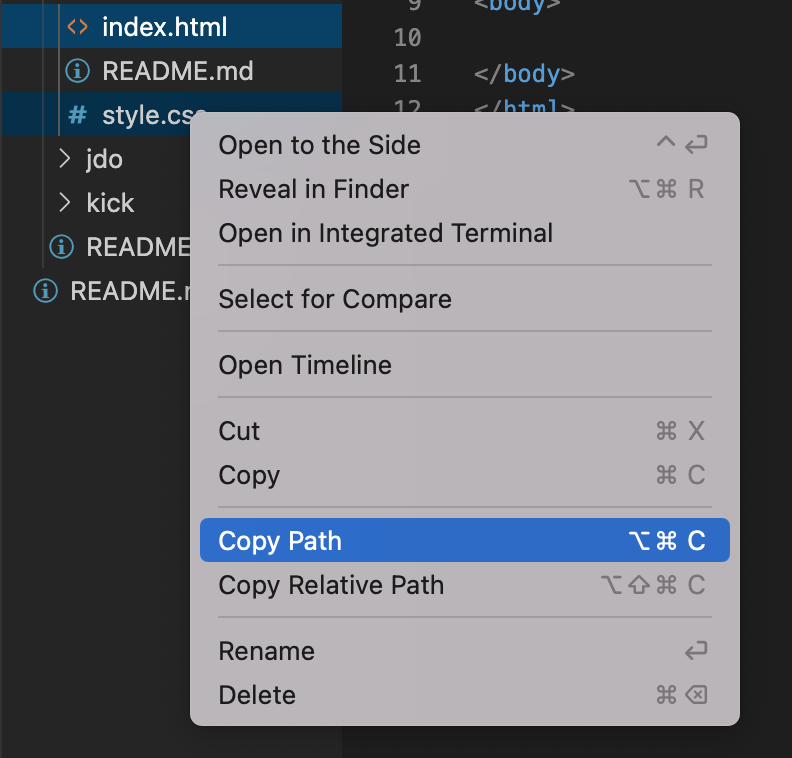
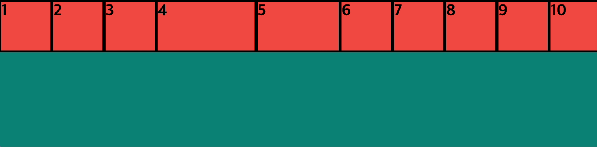
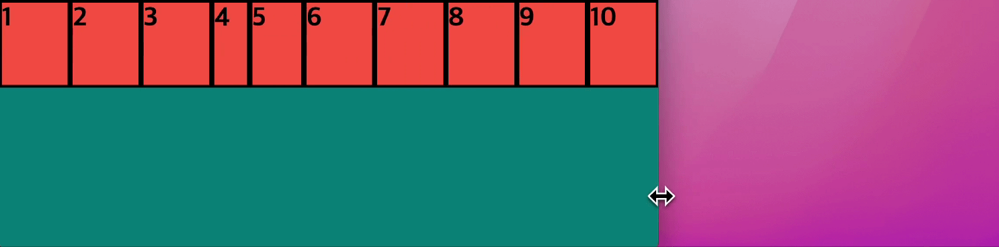
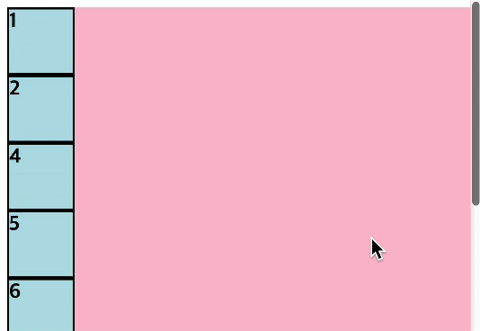
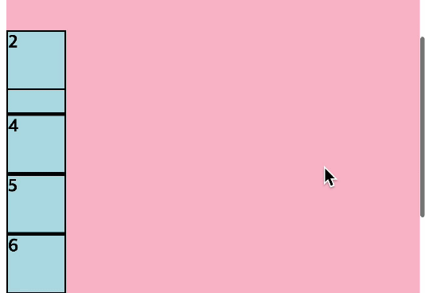

# 2. CSS


## 1. 소개

- CSS는 HTML 파일을 꾸며주는 것.

- HTML → 뼈대, CSS → 뼈대 위에 붙여진 살, Javascript → 정적인 것에 숨을 불어넣어 동적인 것으로 만듦

- 확장자명 `.css`로 파일을 생성하면 그 파일은 자동으로 css 파일이 됨.

- html과 css 파일을 연결하기 위한 코드
    
    ```html
    <link rel="stylesheet" href="">
    ```
    
    - `rel` : 연결하고자 하는 파일과 html 파일과의 관계 ( css의 경우 html을 꾸며주는 역할이기 때문에 stylesheet )
    - `href` : 연결하고자 하는 파일의 위치
        - **상대경로 : 지금 현재 있는 html 파일을 시작점으로 css 파일의 위치를 말함 (주로 많이 쓴다)**
            - `./` : 현재 이 파일과 같은 레벨에 있다는 것을 의미
            - `../` : 상위에 있는 폴더나 파일들을 보여준다.
        - 절대 경로 : 컴퓨터의 루트(제일 상위 폴더)에서 css 파일까지의 위치를 말함
        - 파일명을 우클릭하면 Copy Path(절대 경로), Copy Relative path(상대 경로) 복사 가능
            
            
            

## 2. 선택자

- HTML 요소를 꾸며주기 전에, CSS에서 HTML 요소를 선택하기 위해 만들어진 것.

- css 문법
    
    ```css
    선택자 { css속성 : value; }
    ```
    

- 태그 선택자 : 태그만 적어주면 끝!
    
    ```css
    div {
    	width: 300px;
    	height: 100px;
    	margin: 10px;
    	font-size: 30px;
    	background-color: pink;
    }
    ```
    

- class 선택자 : class 이름 앞에 `.`을 붙여준다. 태그와 관계없이 동일한 스타일을 적용하고 싶을 때 사용
    
    ```html
    <div>1</div>
    <div>2</div>
    <div class="lightblue">3</div>
    <div class="orange">4</div>
    <div>5</div>
    <div class="lightblue orange">6</div>
    <p class="lightblue">hi</p>
    <input type="text"/>
    ```
    
    - 한 요소에 여러개의 class를 쓸 때는 공백으로 구분해준다.
    
    ```css
    .lightblue {
    	background-color: lightblue;
    }
    
    .orange {
    	background-color: orange;
    }
    ```
    
    - css는 위에서 아래로 순차적으로 적용된다.
        
        ```css
        .lightblue {
        	background-color: lightblue;
        }
        
        .orange {
        	background-color: orange;
        }
        ```
        
        
        
        ```html
        .orange {
        	background-color: orange;
        }
        
        .lightblue {
        	background-color: lightblue;
        }
        ```
        
        
        

- id 선택자 : id 앞에 `#`을 붙여준다. class와 달리 **동일한 id를 여러 element에 줄 수 없**고, **한 element는 여러 id값을 가질 수 없**다.
    
    ```html
    <div id="yellow">5</div>
    ```
    
    ```css
    #yellow {
    	background-color: yellow;
    }
    ```
    

- css 우선 순위 : 범위가 좁은 것 순으로 우선순위가 결정된다
    - id > class > tag
    - `!important` : 우선 순위를 무시하고 가장 우선해서 스타일이 적용된다. (권장X)
        
        ```css
        div {
        	background-color: pink !important;
        }
        ```
        

- 가상 선택자 : 일반 선택자들로 선택할 수 없는 것들을 선택 (대표적으로 특정 상태를 선택하는 선택자가 있음)
    - `:hover` : 마우스를 요소 위에 올린 상태이면 선택
        
        ```css
        div:hover {
        	background-color: grey;
        }
        ```
        
    - css 우선순위 : id 선택자 > class 선택자 = 가상 선택자
        - id를 가진 요소에 hover를 넣고 싶다면 `#id:hover`를 통해 넣어줄 수 있다.
    - `:active` : 마우스로 계속 클릭하고 있는 상태이면 선택
    - `:focus` : 키보드 이벤트를 허용하는 요소*(ex. input)*에 포커스가 된 상태이면 선택
    - `:nth-child(n)` : :nth-child를 붙인 대상과 같은 것들 중 n번째 요소를 선택

- 전체 선택자 `*` : 모든 요소들을 선택해주는 선택자

- 선택자 사이의 공백 : 부모와 자식 관계를 나타냄 → *앞에 있는 것 : 부모, 뒤에 있는 것 : 자식*
    
    ```html
    <div>
    	<span>100</span>
    </div>
    ```
    
    ```css
    div span { /* div 안의 span을 선택 -> div가 부모요소, span이 자식요소 */
    	font-size : 1.5em;
    }
    ```
    

## 3. properties

- [MDN CSS](https://developer.mozilla.org/ko/docs/Web/CSS/Reference) > Properties : css 속성 목록들을 확인할 수 있음
    - 휴지통 아이콘 : 더 이상 지원하지 않아 사용을 자제하라는 의미
    - 실험 아이콘 : 아직 실험 단계라 지원하지 않는 브라우저가 있으니 유의하며 사용하라는 의미
    - 속성을 클릭하면 사용하는 방법, 예시, 브라우저 별 지원 여부를 확인할 수 있음

- block element vs inline element
    - inline : span, a, img, button
    - block : p, div, ul, li, h1-h6
    
    
    
    - css를 이유로 태그를 골라쓰면 안됨! → css에서 이런 속성을 변경할 수 있다 ⇒ display
        - none : 요소를 보이지 않게 함
        - inline : 요소를 inline 요소로 변경
        - block : 요소를 block 요소로 변경
        - inline-block : inline처럼 한 줄에 여러 element들이 올 수 있고, 동시에 width와 height값을 가질 수 있음.
    
- box model : content, padding, border, margin
    
    
    
    - padding: border와 content 사이의 간격
    - border : 테두리, 보통 css에서 굵기, [종류](https://developer.mozilla.org/ko/docs/Web/CSS/border-style), 색상 순으로 작성함.
        
        ```css
        div {
        	border: 1px solid black;
        }
        ```
        
    - margin : 다른 박스들과의 간격
    
    ⇒ 이 세가지는 상하좌우 개별적으로 값이 지정이 가능함.
    
    ```css
    div {
    	border-top-width: 15px;
    	margin : 5px 10px 20px 30px;
    			/*  top right bottom left  */
    } 
    ```
    

- box-sizing
    - content-box : 기본값, 오직 content 영역까지만의 크기 설정
    - border-box : border까지의 크기 설정
        - width = border 값 + padding 값 + content width 값

- 단위
    - 절대단위 : `px`
    - 상대단위 : `%`, `em`, `rem` → 화면 크기별로 사이즈가 자동적으로 변함
        - `%`, `em` : 부모 요소가 기준
        - `rem` : (root em) 가장 최상위 태그(html 태그)가 기준으로
        - `%`는 height, width 값을 지정할 때, `em`과 `rem`은 font size를 지정할 때 자주 씀
        
- user agent stylesheet : 브라우저마다 존재하는 태그에 대한 기본 스타일링
    
    
    
    
    
    - 브라우저에서 제공하는 스타일링 모두 초기화하기
        - [reset css](https://meyerweb.com/eric/tools/css/reset/)
            
            ```css
            html, body, div, span, applet, object, iframe,
            h1, h2, h3, h4, h5, h6, p, blockquote, pre,
            a, abbr, acronym, address, big, cite, code,
            del, dfn, em, img, ins, kbd, q, s, samp,
            small, strike, strong, sub, sup, tt, var,
            b, u, i, center,
            dl, dt, dd, ol, ul, li,
            fieldset, form, label, legend,
            table, caption, tbody, tfoot, thead, tr, th, td,
            article, aside, canvas, details, embed, 
            figure, figcaption, footer, header, hgroup, 
            menu, nav, output, ruby, section, summary,
            time, mark, audio, video {
            	margin: 0;
            	padding: 0;
            	border: 0;
            	font-size: 100%;
            	font: inherit;
            	vertical-align: baseline;
            }
            /* HTML5 display-role reset for older browsers */
            article, aside, details, figcaption, figure, 
            footer, header, hgroup, menu, nav, section {
            	display: block;
            }
            body {
            	line-height: 1;
            }
            ol, ul {
            	list-style: none;
            }
            blockquote, q {
            	quotes: none;
            }
            blockquote:before, blockquote:after,
            q:before, q:after {
            	content: '';
            	content: none;
            }
            table {
            	border-collapse: collapse;
            	border-spacing: 0;
            }
            ```
            
        - 혹은 전체선택자 `*`를 이용할 수도 있다.
            
            ```css
            * {
            	margin : 0;
            	padding : 0;
            }
            ```
            
    - inline-block을 사용했을 때 생기는 여백은 태그와 태그 사이에 생기는 공백이라 없앨 수 없다. → flex를 이용하는 추세
        
        
        
    

## 4. flexbox

- flexbox : layout을 짜는 방법 중 하나, **flex-container**와 **flex-item**으로 구성됨
    
    
    
    - main axis : 메인이 되는 축 (수평일 수도 있고, 수직일 수도 있다.)
    - cross axis : main axis의 반대되는 축
- flex-direction : row(가로), row-reverse, column(세로), column-reverse
    - `flex-direction: row;` (기본값)
        
        
        
    - `flex-direction: row-reverse;`
        
        
        
    - `flex-direction : column;`
        
        
        
    - `flex-direction : column-reverse;`
        
        
        
    
- justify-content : main axis를 기준으로 정렬하는 속성
    - `justify-content: flex-start;` (기본값)
        
        
        
    - `justify-content: flex-end;`
        
        
        
    - `justify-content: center;`
        
        
        
    - `justify-content: space-between;`
        
        
        
    - `justify-content: space-evenly;`
        
        
        
    - `justify-content: space-around;` : space-evenly와 달리 양 끝 item은 다른 item들 사이의 공백의 반만큼의 공백만 가짐
        
        
        

- align-items : cross axis를 기준으로 정렬하는 속성
    - `align-items : stretch;` (기본값)
        
        
        
    - `align-items : flex-start;`
        
        
        
    - `align-items : flex-end;`
        
        
        
    - `align-items : center;`
        
        
        
    - `align-items : base-line;` text의 base line을 기준으로 정렬
        
        
        

- flex-grow, flex-shrink *(자식 태그인 flex-item에 적용)*
    - flex-grow : 넓이가 넓어졌을때 content 크기를 얼만큼 늘릴 것인지를 결정
        
        ```css
        .flex-item:nth-child(4) {
          flex-grow: 3;
        }
        .flex-item:nth-child(5) {
          flex-grow: 2;
        }
        ```
        
        
        
        - 기본값은 0
        - 4번째 5번째 div의 크기가 계산되는 방식
            - flex-container의 width(1200px)에서 flex-item들의 원래 width(100px * 10)을 뺀 나머지 크기(1200-1000 = 200px)를 flex-grow의 값만큼의 비율(3:2)로 나누어 가진다.
            - 4th div → 100 + 200 * 3/5 = 220
            - 5th div → 100 + 200 * 2/5 = 180
    - flex-shrink  : 넓이가 좁아졌을때 content 크기를 얼만큼 줄일 것인지를 결정
        
        ```css
        .flex-item:nth-child(4) {
          flex-shrink: 3;
        }
        .flex-item:nth-child(5) {
          flex-shrink: 2;
        } 
        ```
        
        
        
        - **기본값은 1** (flex-shrink 값을 정해주지 않았더라도 width가 줄어들면 모든 item이 축소된다.)
        - 4번째 5번째 div의 크기가 계산되는 방식
            - width가 작아졌을 때 줄어든 크기(1000-870 = 130px)만큼 각각의 item에서 빼는 것
            - 4th div → 100 - 130 * 3/13 = 70
            - 5th div → 100 - 130 * 2/13 = 80
            - etc div → 100 - 130 * 1/13 = 90

- [flex 속성](https://developer.mozilla.org/ko/docs/Web/CSS/flex) : flex-grow, flex-shrink, flex-basis를 통합해서 사용하는 속성
    - flex-basis : width가 없을 때, width를 대신해서 flex-grow, flex-shrink를 사용할 때 시작점이 되어주는 것. (잘 사용하지 않고, 보통 flex-item에 width를 설정해준다.)
    - value값이 하나
        - unit이 없는 숫자 → flex-grow
        - unit이 있는 경우 → flex-basis
    - 2개의 value 값
        - 첫번째 → flex-grow
        - 두번째 → flex-shrink(unit X), flex-basis(unit O)
    - 3개의 value 값
        - 첫번쨰 → flex-grow
        - 두번째 → flex-shrink
        - 세번째 → flex-basis

- flex-wrap 속성 *(부모 태그인 flex-container에 적용)*
    - `flex-wrap : nowrap;` (기본값) : content 크기가 width에 맞게 축소되는 형태
        
        
        
    - `flex-wrap : wrap;` : width가 줄어들었을 때, 넘친 content들이 다음줄로 넘어감
        
        
        
        - align-content : flex-wrap 속성이 wrap일 때만 사용할 수 있는 속성 (여러줄인 content를 수직축 방향으로 정렬할 때 사용한다)
            - flex-start, flex-end, center, stretch, space-betwwen, space-around, space-evenly
    - `flex-wrap : wrap-reverse;` : wrap과 동일하지만 끝점에서 시작점으로 정렬됨
        
        
        

- flexbox 연습사이트 : [flexbox froggy](https://flexboxfroggy.com/#ko)

- CSS 연습사이트 : [CSS Diner](https://flukeout.github.io/)

## 5. position

- `position: static;` : 기본값

- `position: relative;`
    - top, bottom, left, right 값으로 static 위치를 기준으로 위치를 변경할 수 있다.
        
        ```css
        .item:nth-child(2) {
          position: relative;
          top: 50px;
        }
        ```
        
        
        
    - z-index 값으로 레이어의 위치를 정해줄 수도 있다.
        
        ```css
        .item:nth-child(2) {
          position: relative;
        	z-index : -1;
        }
        ```
        
        
        
        ```css
        .item:nth-child(2) {
          position: relative;
          top: 100px;
          left: 300px;
        }
        
        .item:nth-child(6) {
          position: relative;
          top: -350px;
          left: 350px;
        }
        ```
        
        
        
        ```css
        .item:nth-child(2) {
          position: relative;
          top: 100px;
          left: 300px;
        	z-index: 2;
        }
        
        .item:nth-child(6) {
          position: relative;
          top: -350px;
          left: 350px;
        	z-index: 1;
        }
        ```
        
        
        

- `position: absolute;` : static이 아닌, 다른 position값을 가지고 있는 부모를 기준으로 함. (*상위 태그들 중 없을 시, root element인 body가 기준*) 마찬가지로 top, bottom, left, right로 위치조정 가능
    
    ```css
    .item:nth-child(2) {
      position: absolute;
      top: 0px;
      left: 0px;
    }
    ```
    
    
    
    → 원래 문맥에서 나와서 다른 태그들보다 위에 위치하고 있다.
    
    → 부모 요소(핑크색 div)에 position이 설정되어있지 않아 body를 기준으로 `top:0;`, `left:0;`이 적용되었다.
    
    ```css
    .container {
      background-color: pink;
      margin: 10px;
      position: relative;
    }
    ```
    
    
    
    → 부모요소에 `position:relative;`를 적용하면, 2번째 div가 해당요소를 기준으로 위치가 변한다. 
    
    → 보통 이렇게 `position: relative;`와 `position: absolute;`를 같이 쓴다.
    
- `position: fixed;` : 스크롤을 했을 때 정해준 위치에 계속 고정된다. / absolute처럼 원래 문맥에서 나와서 다른 태그들보다 위에 위치하고, veiwport(화면 전체)가 기준이 된다.
    
    ```css
    .item:nth-child(2) {
      position: fixed;
    }
    ```
    
    
    

- `position: sticky;` : 스크롤을 했을때, 정해준 위치에 닿고 거기서 더 넘으면 그자리에 계속 보이도록 함 / top, bottom, left, right 값을 적어도 하나 가지고 있어야 함
    
    ```css
    .item:nth-child(2) {
      position: sticky;
      top: 50px;
    }
    ```
    
    
    

## 6. 실습

- 웹사이트에 사용된 font 알아내기
    - 크롬 개발자도구에서 input의 placeholder 선택하기
    
    
    
    - 크롬 확장프로그램 활용하기 (WhatFont)
        
        [WhatFont](https://chrome.google.com/webstore/detail/whatfont/jabopobgcpjmedljpbcaablpmlmfcogm?hl=ko)
        
- 웹사이트의 요소에 사용된 color 알아내기
    - 크롬 확장프로그램 (ColorZilla)
        
        [ColorZilla](https://chrome.google.com/webstore/detail/colorzilla/bhlhnicpbhignbdhedgjhgdocnmhomnp?hl=ko)
        
- 웹폰트 사용하기
    - Google Fonts
        
        [Google Fonts](https://fonts.google.com/)
        
        
        
        1. HTML 파일의 <title> 아래에 <link> 항목을 붙여넣기
            
            ```html
            <title>Yourtube Clone</title>
            <link rel="preconnect" href="https://fonts.googleapis.com">
            <link rel="preconnect" href="https://fonts.gstatic.com" crossorigin>
            <link href="https://fonts.googleapis.com/css2?family=Roboto&display=swap" rel="stylesheet">
            ```
            
        2. CSS 파일에서 font-family로 font 사용하기
            
            ```css
            * {
            	font-family: 'Roboto', sans-serif;
            }
            ```
            
        
- CSS 속성 초기화 (전체, button, a)
    
    ```css
    * {
      font-family: 'Roboto', sans-serif;
      margin: 0;
      padding: 0;
      box-sizing: border-box;
    }
    
    button {
      border: none;
      background-color: transparent;
      cursor: pointer;
    }
    
    a, a:active {
      text-decoration: none;
      color: inherit;
    }
    ```
    

- vscode에서 원하는 단어를 모든 줄에서 찾아 선택하기
    - 원하는 단어 드래그 후 → cmt + shift + L